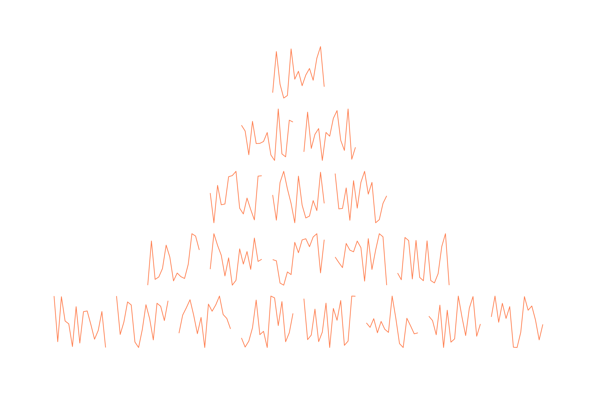
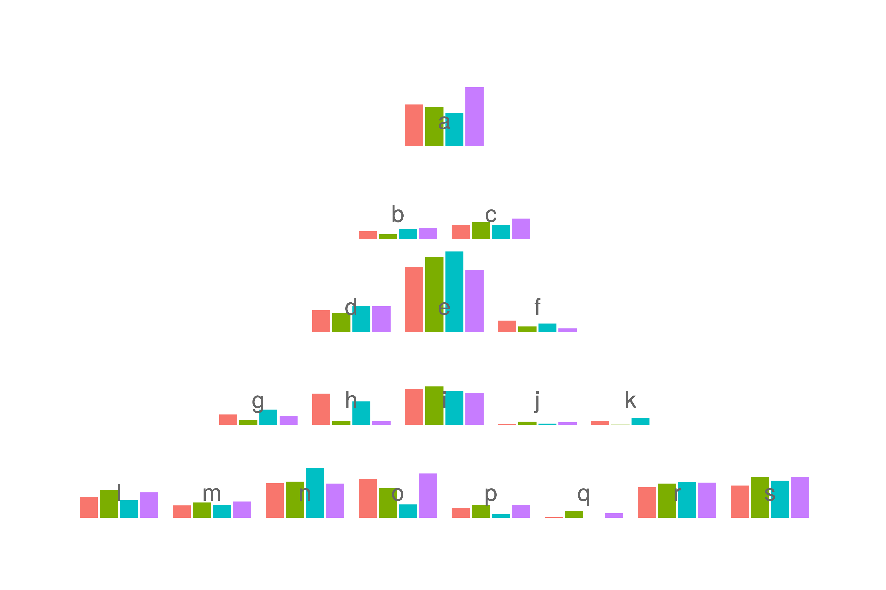
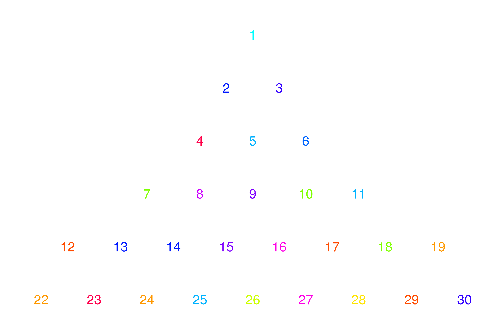
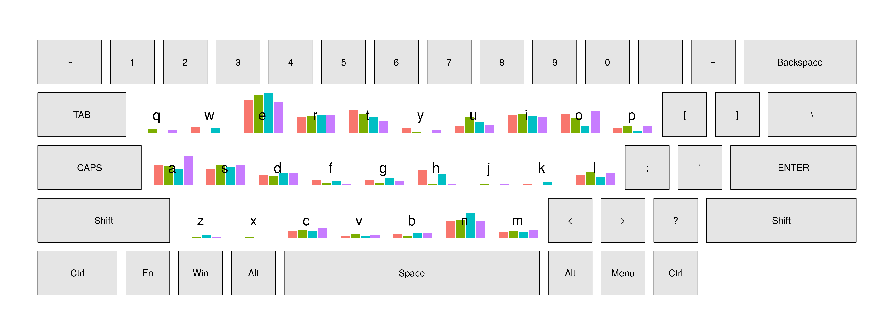
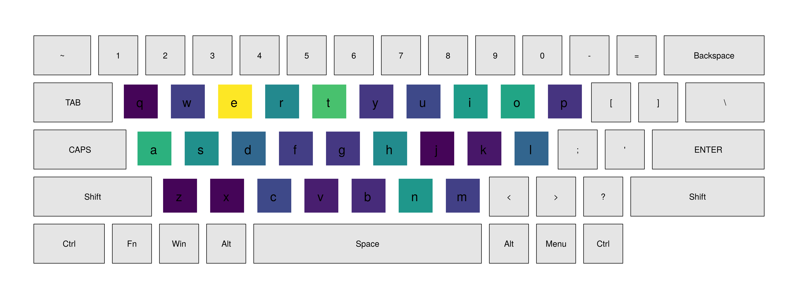

# ggshape

[](https://travis-ci.org/jonocarroll/ggshape)

Arrange `facet`-like `ggplot` plots in a pre-defined, non-grid shape.

## Installation

``` r
devtools::install_github("jonocarroll/ggshape")
```

## Examples

The original motivation for this package was to arrange facets off-center, such as

``` r
plot_triangle(letters[1:19], ggshape_random_walk,
                       nrow = 5, user_scale = "3cm", gap_size = 0.2,
                       point = "top")
```


The plotting function is entirely user-specified, so it can be replaced with any other `ggplot` call

``` r
plot_triangle(letters[1:19], ggshape_lang_diffs,
                         nrow = 5, user_scale = "3cm", gap_size = 0.2,
                         point = "top")
```


The placement in the triangle is entirely procedural, so it works for any number of rows

``` r
plot_triangle(1:32, ggshape_rainbow_text,
                         nrow = 6, user_scale = "3cm", gap_size = 0.2,
                         point = "top")
```


Another pre-defined pattern of interest may be useful for text analysis

``` r
plot_keyboard(ggshape_lang_diffs)
```


``` r
plot_keyboard(ggshape_english_usage)
```

